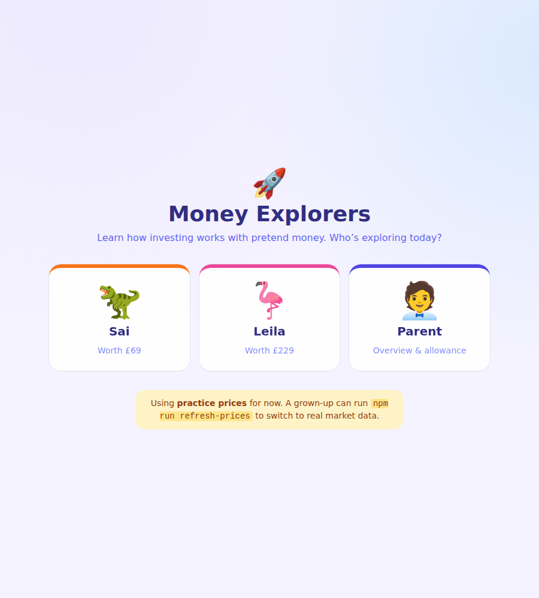

# 🚀 Junior Traders — Kids' Investing Dashboard

A friendly, game-like app that teaches **Sai (10)** and **Leila (13)** the basics of
investing using **pretend money**. There is no real brokerage, no real money, and nothing
at stake — the whole point is to learn how investing works and to build good habits
(patience, spreading your money out, and thinking before you trade).

> Every feature is meant to *teach* something, not just show a number.



---

## What it does (v1)

- **Three profiles** — Sai, Leila, and a Parent overview. Each child has a
  **Simple ↔ Detailed** toggle so the app grows with them.
  - *Simple* (great for Sai): huge numbers, green-up / red-down colour cues, almost no jargon.
  - *Detailed* (for Leila): adds P/E, market cap, dividend yield, revenue growth and longer charts.
- **Portfolio tracking** — total worth, and gain/loss in **£ and %**, with clear up/down colours.
- **Charts** — your whole portfolio's value over time, and the price history of anything you own.
- **A curated universe** — ~30 familiar companies (Apple, Nintendo, LEGO-maker rivals,
  Disney, ASOS, Burberry, LVMH, Rolls-Royce, Games Workshop…) and ~20 themed baskets
  (S&P 500, FTSE 100, India, semiconductors, gaming, robotics & AI, clean energy…), each
  with a **plain-English "what is this?"** blurb.
- **Trading with a reason** — before any buy or sell goes through, you must write a one-line
  **"why I'm buying this"** note. Those notes build a **trade diary** to look back on.
- **Learn-as-you-go tooltips** — tap any underlined word (P/E, dividend, market cap…) for a
  kid-friendly explanation.
- **Parent view** — see both children's portfolios at a glance and **top up their allowance**.

Everything is saved in the browser (localStorage) on the one computer or home server you
run it on, so the Parent view can see both kids. No accounts, no passwords, no server.

### Planned next (not in this version)

Weekly kid-friendly market recap · sector/geography diversification chart with a gentle
"more than 40% in one thing" nudge · benchmark vs FTSE 100 / S&P 500 · badges, leaderboard
and a weekly check-in streak · a "what if you'd held this 10 years" projector · a dividend
reinvestment simulator · parent editing of the stock/ETF list and diversification rules.

---

## Getting started

You'll need **Node.js 22.6 or newer** ([nodejs.org](https://nodejs.org)).

```bash
npm install          # install dependencies (first time only)
npm run dev          # start the app
```

Then open the link it prints (usually <http://localhost:5173>). Because the dev server is
started with `--host`, other devices on your home Wi-Fi can open it too using the
computer's local IP (e.g. `http://192.168.1.20:5173`).

To make a production build you can host on a home server:

```bash
npm run build        # outputs a static site into dist/
npm run preview      # preview that build locally
```

The contents of `dist/` are just static files — copy them to any simple web server.

---

## Real prices (daily)

The app reads prices from a local file, `src/data/prices.json`. It ships with **placeholder
practice prices** so it works the moment you open it. To switch to **real end-of-day market
prices**, run:

```bash
npm run refresh-prices
```

This fetches real daily prices (from Yahoo Finance's free, no-key chart endpoint),
converts everything to **£**, and rewrites `prices.json`. Daily is plenty for a learning
tool — you don't need live ticking prices.

**Keep it fresh automatically (optional):**

- **macOS / Linux (cron):** run `crontab -e` and add a line to refresh every evening:
  ```
  0 18 * * * cd /path/to/this/project && /usr/local/bin/npm run refresh-prices
  ```
- **Windows:** use Task Scheduler to run `npm run refresh-prices` in this folder once a day.

If the fetch is ever blocked or a symbol can't be found, that asset is simply hidden and the
app keeps working — just run it again later. After a successful refresh, the header changes
from "Practice prices" to "Real market prices".

> Note: prices are for **learning only**. This is not financial advice, and the app never
> touches real money or a real brokerage.

---

## Hosting it online (auto-updating, no computer needed)

The repo includes a GitHub Actions workflow (`.github/workflows/deploy.yml`) that publishes
the app to **GitHub Pages** and refreshes real prices **once a day automatically** — so you
just open a link and it stays current, with no computer running at home.

One-time setup (two settings in your repo on github.com):

1. **Make the repo public** (free Pages needs this; there are no secrets here — it's a
   pretend-money learning app): _Settings → General → Danger Zone → Change visibility →
   Public_. (Or keep it private if you have a paid GitHub plan.)
2. **Turn on Pages**: _Settings → Pages → Build and deployment → Source → **GitHub Actions**_.

Then run the workflow once (_Actions → Build & deploy Junior Traders → Run workflow_). After
it finishes, your site is live at:

```
https://<your-username>.github.io/Shyam-Project-One/
```

It then rebuilds itself every day with fresh real prices. Nothing to install or maintain.

---

## Adding or changing companies & funds

Everything in the investable universe lives in one place: **`src/data/universe.ts`**. Each
entry has a ticker, a real market `source` symbol (used by the refresh script), a friendly
blurb, an emoji, a sector and geography, and a reference price. Add an object to `STOCKS` or
`ETFS`, then run `npm run refresh-prices` to pull its real price history.

---

## How it's built

- **React + TypeScript + Vite** — a fast, modern single-page app.
- **Tailwind CSS** for styling, **Recharts** for charts. No web fonts or external calls at
  runtime, so it works offline.
- **No backend.** All state is in the browser; prices are a static local JSON file.

```
scripts/refresh-prices.mjs   fetch real £ end-of-day prices → src/data/prices.json
src/data/universe.ts         the curated stocks & ETFs (edit me to add names)
src/data/seed.ts             the friendly starting scenario for each child
src/lib/                     prices, portfolio maths, formatting, storage
src/state/store.tsx          app state + the buy/sell/top-up rules
src/components/              the screens (kid views, parent view, shared bits)
```

To start over from the friendly starting scenario, clear the site's storage in your
browser (DevTools → Application → Local Storage → delete the `money-explorers:v1` key).

---

Made for a family, to learn together. 💛
